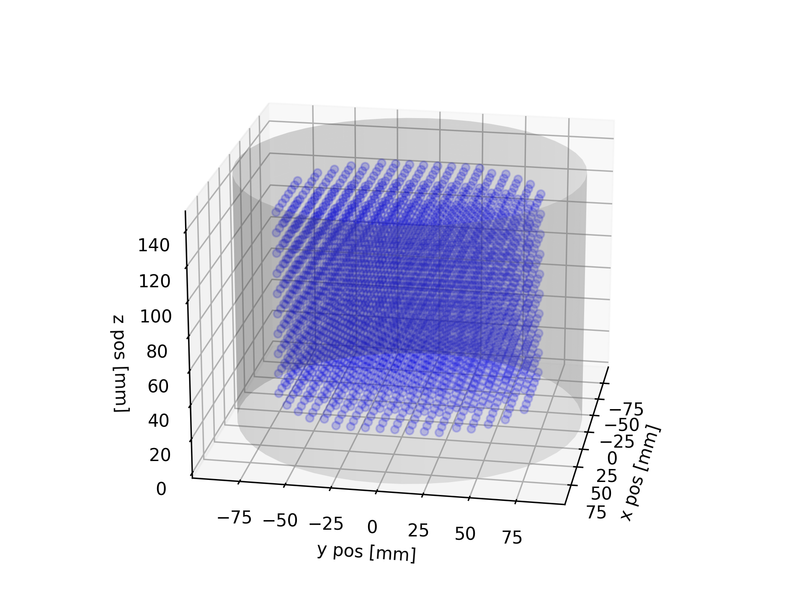
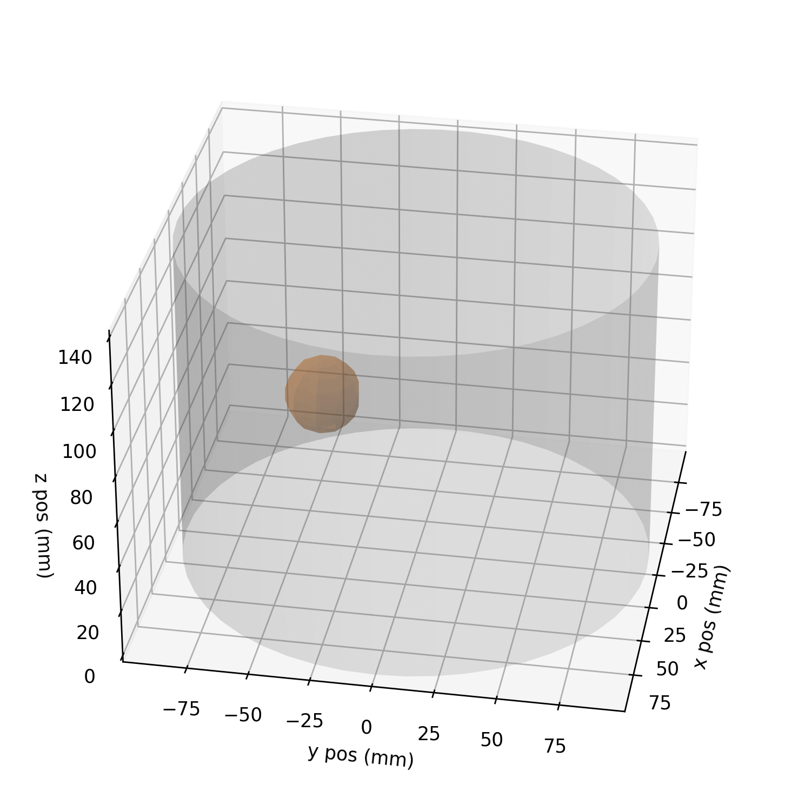

# 3dIT
Repository for 3D Eit measurement with a modified Ender 5 3D printer and the ScioSpec Eit device.

___

_Based on: [sciospeceit](https://github.com/JacobTh98/sciospeceit)_

## Starting

### Generate Measurement Coordinates

Import the required libraries:

    from src.classes import BallObjectProperties, HitBox, TankProperties32x2
    from src.functions import compute_hitbox, create_meas_coordinates, print_coordinates_props
    from src.visualization import plot_meas_coords, plot_meas_coords_wball

Define variables that contain the information and parameters of the tank, ball, and hitbox, saved in the provided dataclasses.

    tank = TankProperties32x2()
    ball = BallObjectProperties(x=0, y=0, z=0, r=20, material=None)
    hitbox = compute_hitbox(tank, ball, safety_tolerance=0)

Create the measurement coordinates using the `create_meas_coordinates()` function. 
This function uses the `numpy` `np.meshgrid` function. Mind that the final x,y,z meshgrid is masked by the `hitbox` to prohibite collisions with the phantom tank. 
This means that the final number of measurements is much smaller than `x_pts`$\cdot$`y_pts`$\cdot$`z_pts`

    coordinates = create_meas_coordinates(hitbox, x_pts=20, y_pts=20, z_pts=10)

To get further information about `coordinates` you can apply the function `print_coordinates_props()`.
For visualizing the created points two functions are provided. For further information, calll the docstring documentation.

    plot_meas_coords(tank=tank, meas_coords=coordinates, p_select=None)

    plot_meas_coords_wball(tank=tank, meas_coords=coordinates, ball=ball, p_select=34)

